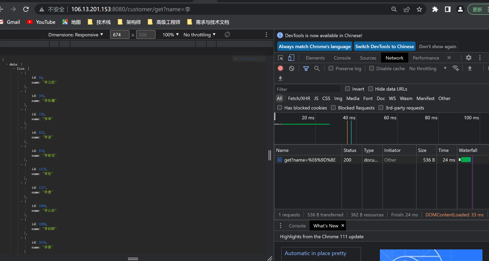

# 工程简介
场景假设:客户(s_customer) 客户与父客户是多对多关系，均有1个或者多个上级客户(父客户)每个客户都有多条银行流水(s bankstatement)，银行流水的付款人与客户名称一致。
需求:
1、银行流水表结构不能修改(字段固定为:流水编号、交易金额、交易日期付款人)
2、子客户数量存在超过5000的情况
3、当前需要做一个数据列表展示银行流水信息，支持用户根据付款人字段进行模糊查询，查询结果包含该客户及其所有子客户的银行流水
注:流水表与客户表无直接关联关系，查询数据时，根据银行流水的付款人名称与客户名称进行精准匹配
根据该需求，设计表结构 (所有需要用到的)，以及编写后端查询代码逻辑跟SOL语句(PS查询性能要高)
## 数据库设计

### 数据库结构(包含造数据函数)
目录:src/main/resources/demo.sql
### 造数据
客户表 超过100万,父子客户关联表超过1.2亿(最高子客户数量达到14600)、银行流水表超过1亿
## 解决流程

提供三个接口分三步来解决这个需求
### 1.根据名称模糊查询

SELECT id,name
FROM s_customer
WHERE
1=1
<if test="name!=null and name!=''">
and MATCH (`name`) AGAINST (#{name} IN BOOLEAN MODE)
</if>
limit #{pageNum},#{size}

http://106.13.201.153:8080/customer/get?name=%E6%9D%8E
百万查询接口24毫秒,因为走了全文索引

### 2.根据选择哪个客户来决定查询其子客户

SELECT
cr.child_id id,
cr.child_name name
FROM
s_customer_rel cr
WHERE
cr.parent_id = #{parentId}
GROUP BY cr.child_id,cr.child_name
limit #{pageNum},#{size}
http://106.13.201.153:8080/customer/getByParentId?parentId=54
### 根据子客户列表点击加载对应的银行流水

SELECT id,amount,name,create_time createTime
FROM s_bankstatement
WHERE
1=1
<if test="name!=null and name!=''">
and name=#{name}
</if>
limit #{pageNum},#{size}

http://106.13.201.153:8080/bankstatement/get?name=%E9%AB%98%E6%96%87